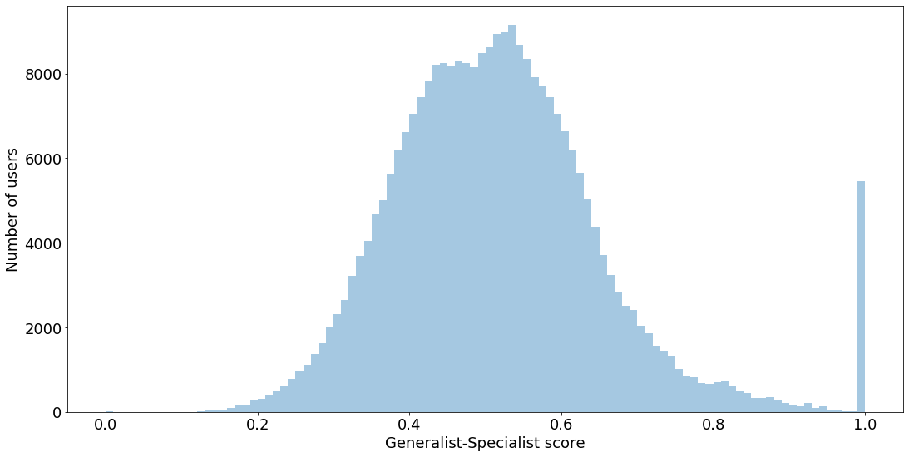

# Diversity Scoring on MovieLens

## Overview

In this repository we implement Spotify's [Generalist-Specialist score](https://dl.acm.org/doi/abs/10.1145/3366423.3380281) 
on the [MovieLens dataset](https://grouplens.org/datasets/movielens/).

The code here accompanies the Medium article "Different Strokes for Different Folks at Spotify".

## Installation

We recommend using Anaconda to create a virtual environment. Install the requirements via
```
conda install --yes --file requirements.txt 
```
or if using `pip`, run
```
pip install -r requirements.txt
```

## Running the Notebook

To run the notebook, simply start a Jupyter notebook session via `jupyter notebook`.
The notebook should be able to download the MovieLens dataset and unzip it in the 
current directory.

Training of the model and scoring the generalist-specialist (GS) scores of all users 
on the MovieLens dataset can be time consuming.

## Results

The results of the GS scores for MovieLens users are shown here:


As can be seen from the histogram above, the majority of users have a wide range of movies watched
and rated. The spike at the 1.0 bin are mainly due to users who have only watched and rated a single
movie. There are 857 users who watched and rated more than a single movie with a GS score of above 0.90
using our trained Word2Vec model.
